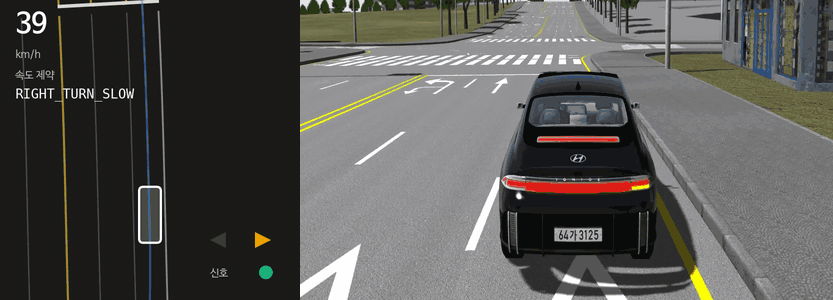
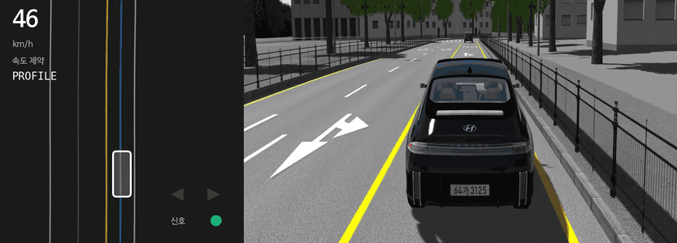
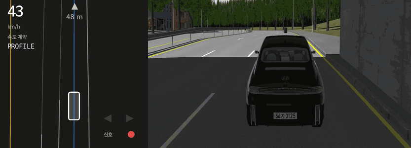
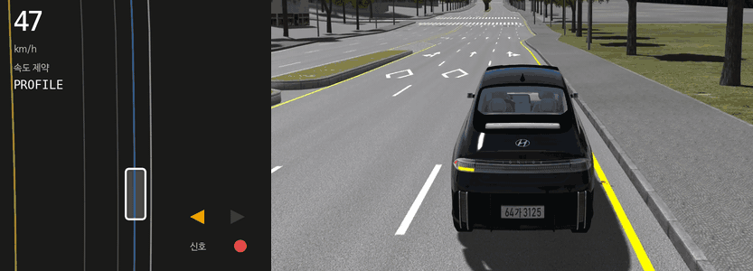
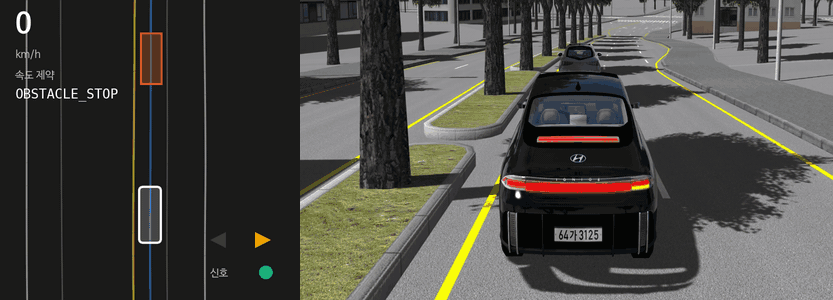
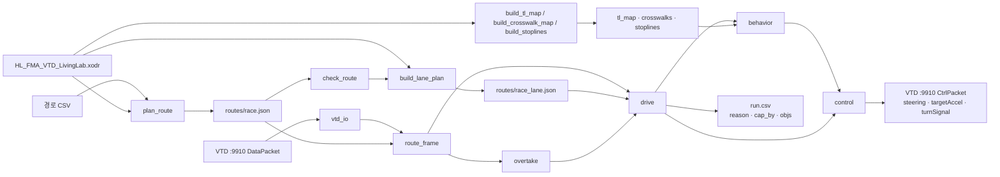

# 2026 HL-FMA 자율주행 경진대회 iVH 시뮬레이션 부문

> **공개본입니다.** 대회 뒤 정리한 코드·문서를 공개하면서 **주최측 자료**는 뺐습니다 —
> LivingLab 지도(`map/HL_FMA_VTD_LivingLab.xodr`), 교육 받아쓰기, 주최측 질의응답, VTD 모델 목록, 공식 코스 좌표(`routes/official_*`·`planned_*`).
> 지도가 필요한 도구·테스트는 대회 참가자에게 배포된 xodr 을 `map/` 에 두어야 돌아갑니다.
> VTD PC 접속 스크립트는 비밀번호를 환경변수(`OMEN_PW`, `PW`)로, 주소를 `VTD_SSH`·`CTRL_SSH`(기본 대회 랜 `192.168.50.11`·`.10`)로 받습니다.

## 개요

이 저장소는 VTD 2025.2 시뮬레이터 기반 자율주행 제어 스택입니다. 전체 시스템은 Map, Decision, Control 스택으로 구성됩니다.

- `Map`: OpenDRIVE 지도 파싱, 차로 단위 경로 계획, 경로점별 차로계획, 신호·횡단보도·정지선 DB
- `Decision`: 9910 GT 수신과 물체 분류, 경로 좌표 투영, 도로교통법 판단, 추월 상태기계, 차로 단위 회피
- `Control`: Pure Pursuit 조향, 2-pass 속도 프로파일, 종방향 PI 제어

2026-09-12 본선에서 코스를 **완주**했습니다 (476 / 500점, 주행 328초). → [결과](docs/06_results.md)

설계·검증·운용의 자세한 내용은 [`docs/`](docs/README.md) 에 장별로 정리했습니다.

왼쪽은 주행 기록(CSV)으로 그린 제어기가 본 장면(차로·경로·물체·속도를 잡은 규칙), 오른쪽은 같은 순간의 VTD 중계 화면입니다.








## 구성

| 영역 | 모듈 | 구현한 내용 |
|---|---|---|
| Map | [`vtd/plan_route.py`](vtd/plan_route.py) | OpenDRIVE 차로 그래프 최단경로, 경유지 층 탐색, 활주로 비례 차선변경 비용, 노면 화살표 우선 |
| Map | [`vtd/build_lane_plan.py`](vtd/build_lane_plan.py) | 경로점별 차로·폭·좌우 여유·지정차로 오프셋·교차로·제한속도·지시등 구간 계산 |
| Map | [`vtd/build_tl_map.py`](vtd/build_tl_map.py) · [`build_crosswalk_map.py`](vtd/build_crosswalk_map.py) · [`build_stoplines.py`](vtd/build_stoplines.py) | 신호 정지선 214개, 횡단보도 195곳, 도색 정지선 710개 DB |
| Decision | [`src/vtd_io.py`](src/vtd_io.py) | 9910 패킷 파싱, 위치 기반 속도 추정, 리스폰 감지, 크기 기반 물체 분류 |
| Decision | [`src/behavior.py`](src/behavior.py) | 신호·보행자·앞차·교차로·횡단보도 판단, 규칙별 속도 상한 중 최솟값 선택 |
| Decision | [`src/overtake.py`](src/overtake.py) | 정지 차량 추월 상태기계 |
| Decision | [`src/drive.py`](src/drive.py) | 경로 추종 스택, 차로 단위 회피, 뒤차 확인, 종점 정차, 지시등 우선순위 |
| Control | [`src/control.py`](src/control.py) | Pure Pursuit, 곡률 기반 2-pass 속도 프로파일, 종방향 PI |


## 목표

- 패킷에 없는 차선·정지선 정보를 지도에서 미리 계산해 주행 판단에 사용
- 대회 당일 받은 좌표 CSV 만으로 차로 단위 경로를 생성하고 주행 전에 검사
- 도로교통법 기반 15개 채점 항목을 규칙별 속도 상한으로 동시에 준수
- 장애물은 차로를 온전히 옮겨 회피하고, 막힌 상황에서도 멈추지 않고 완주

## 파이프라인



## 주요 기능

### 1. 지도 기반 경로 계획

- OpenDRIVE 의 차로를 노드로, lane link 와 같은 도로 안 차선변경을 간선으로 둔 최단경로 탐색
- 경유지 진행 상태를 탐색 노드에 넣어 구간 이음매의 역방향 도착 방지
- 남은 활주로에 반비례하는 차선변경 비용, 노면 화살표를 laneLink 보다 우선
- 경로점마다 차로 폭, 같은 방향 좌우 여유, 지정차로 오프셋, 교차로 여부, 제한속도, 지시등 구간 계산
- 역주행·도로 밖·곡률·화살표 위반 등 9개 항목 사전검사

### 2. 도로교통법 판단

- 규칙마다 속도 상한을 내고 그중 최솟값을 명령 속도로 사용
- 속도를 잡은 규칙 이름(`cap_by`)을 매 프레임 기록
- 적색·적색점멸 정지선 정지, 보행자 양보, 횡단보도 일시정지, 비보호 좌회전 양보, 교차로 꼬리물기 금지
- 차선변경 지시등을 법 30 m 와 대회 3초 기준 중 긴 쪽으로 선행 점등


### 3. 회피와 추월

- 최대 변 1.2 m 이상인 정지 차량은 추월 상태기계(FOLLOW → WAIT → PASS → RETURN)로 처리
- 작은 물체와 서 있는 사람은 옆 차로가 있으면 차로 하나를 온전히 옮겨 회피
- 진로변경 전 옮길 자리 뒤 35 m 의 접근 차량 확인
- 중앙선 너머는 회피 공간으로 사용하지 않음

## 모듈별 요약

### `vtd/plan_route.py` · `vtd/build_lane_plan.py`

이 모듈은 대회 당일 받은 좌표로 차로 단위 경로와 차로계획을 만듭니다.

- 입력:
  - 경로 CSV(`seq,x,y`)
  - `map/HL_FMA_VTD_LivingLab.xodr`
  - 시뮬레이터에서 읽은 ego 헤딩
- 주요 출력:
  - `routes/<코스>.json` — 경로점, 경로점별 도로·차로
  - `routes/<코스>_lane.json` — `lane` `w` `l` `r` `xl` `xr` `need` `sig` `j` `jx` `lim`

### `src/` (주행 스택)

이 모듈은 VTD 패킷을 받아 매 프레임 조향·가속·지시등을 계산합니다.

- 입력:
  - `VTD :9910 DataPacket` — ego 위치·자세, 물체 30개, 신호 상태
  - `routes/<코스>.json`
  - `routes/<코스>_lane.json`
  - `routes/tl_map_livinglab.json`
  - `routes/crosswalks.json`
  - `routes/stoplines.json` · `routes/stoplines_all.json`
- 주요 출력:
  - `VTD :9910 CtrlPacket` — `steering[rad]` `targetAccel[m/s²]` `turnSignal`
  - 주행 CSV — `x` `y` `v` `reason` `cap_by` `sig` `off` `objs` `nudge`

### `eval/`

이 모듈은 VTD 없이 제어 스택을 검증하고, 실주행 로그를 대회 기준으로 채점합니다.

- 주요 입력:
  - `eval/scenarios/*.json` — 오프라인 시나리오 35판과 기준 점수
  - 주행 CSV
  - 경로 파일 · 차로계획 · xodr
- 주요 출력:
  - 판별 점수와 기준선 일치 여부(`run_all.sh`)
  - 경로 사전검사 결과(`check_route.py`)
  - 구간별 15개 항목 감점표(`score_fma.py`)

## 저장소 구조

```text
.
├── src
│   ├── main.py
│   ├── vtd_io.py
│   ├── route_frame.py
│   ├── drive.py
│   ├── behavior.py
│   ├── overtake.py
│   └── control.py
├── vtd
│   ├── plan_route.py
│   ├── build_lane_plan.py
│   ├── load_scenario.py
│   ├── record_run.sh
│   └── ...
├── eval
│   ├── mock_vtd.py
│   ├── run_all.sh
│   ├── check_route.py
│   ├── score_fma.py
│   └── scenarios
├── routes
├── scenarios
├── map
├── tests
├── docs
└── drive.sh
```

## 기술 스택

- VTD 2025.2 (Hexagon)
- Python 3 (표준 라이브러리, ROS 미사용)
- OpenDRIVE
- TCP 소켓 (9910) · RTSP (8554)
- matplotlib
