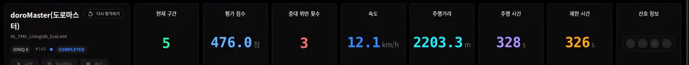
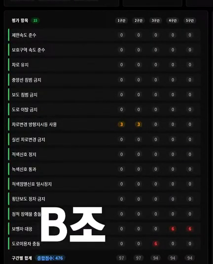
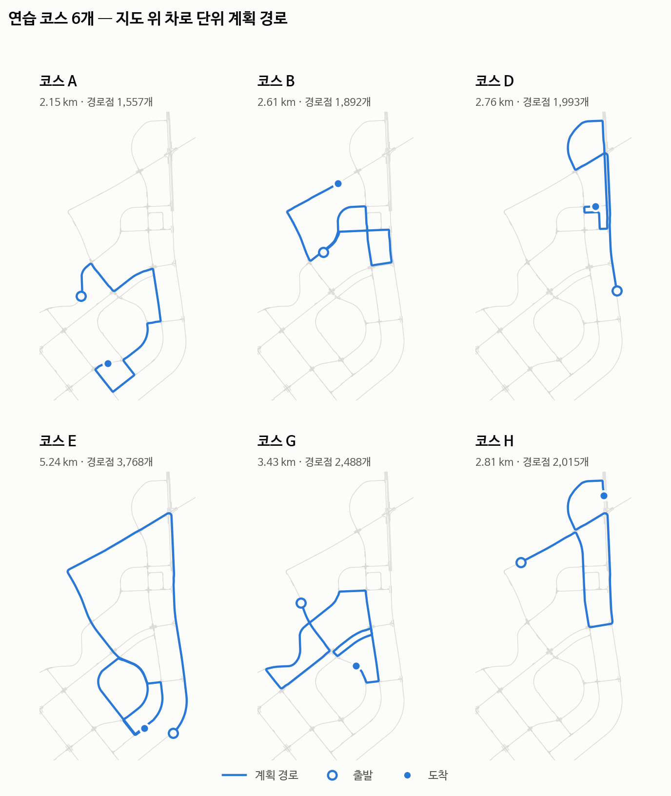

# 6장. 결과

[← 문서 목차](README.md) · [README](../README.md)

## 6.1 대회 — 완주, 476 / 500

2026-09-12 본선에서 우리 팀 **doroMaster**(B조)는 코스를 **완주**했다.

| | |
|---|---|
| 결과 | **완주** — 주행거리 2,203.3 m, 구간 5/5, 판 상태 `COMPLETED` |
| 평가 점수 | **476.0 / 500** |
| 주행 시간 | **328 초** (제한 575초) |
| 중대 위반 | 3회 |
| 판 번호 · 조 | #145 · B조 |

출처: 대회 공개 중계 다시보기 5:59:10 무렵 화면. 코드는 대회 전날 밤 확정한 `main` **32fb790**.

### 항목별 감점 — 15개 중 12개가 5구간 내내 0

| 항목 | 1구간 | 2구간 | 3구간 | 4구간 | 5구간 |
|---|---:|---:|---:|---:|---:|
| 차로변경 방향지시등 사용 | **3** | **3** | 0 | 0 | 0 |
| 보행자 대응 | 0 | 0 | 0 | **6** | **6** |
| 도로이용자 충돌 | 0 | 0 | **6** | 0 | 0 |
| 그 밖의 12개 항목 | 0 | 0 | 0 | 0 | 0 |
| **구간 점수** | **97** | **97** | **94** | **94** | **94** |

감점이 한 번도 없었던 12개 항목 — 제한속도 · 보호구역 속도 · 차로 유지 · 중앙선 · 보도 · 도로 이탈 ·
실선 차로변경 · 적색신호 정지 · 녹색신호 통과 · 적색점멸 일시정지 · 횡단보도 정차 · 정적 장애물 충돌.

감점 24점은 전부 **다른 도로 사용자와 얽힌 장면**에서 나왔다. 속도·차로·신호처럼 지도와 규칙만으로 정해지는 항목은 5구간 내내 0이었다.

 

> ⚠️ **대회 판의 주행 로그(CSV)는 확보하지 못했다.** 평가 화면은 어느 항목이 몇 구간에서 깎였는지까지만 보여 준다.
> 아래는 원인이 **아니라**, 대회 전에 이미 알고 있던 한계 중 **이 항목들과 맞닿는 것**을 적은 것이다.

| 깎인 항목 | 대회 전에 알고 있던 관련 한계 |
|---|---|
| 보행자 대응(중대) ×2 | 사람이 늦게 차 앞 4.5 m 폭 안으로 들어오면 급제동한다. 서 있는 사람 옆은 7 km/h 로 지나가는데, 이것이 "무정차 통과"로 판정될 여지가 있었다 |
| 도로이용자 충돌(중대) ×1 | 끼어드는 NPC 는 우리 책임이라는 주최측 답변. 오프라인 돌발 판은 전부 통과했지만 VTD 교통의 반응까지는 재현하지 못한다 |
| 방향지시등(경미) ×2 | 경로에 박힌 차선변경의 지시등이 **다른 신호에 밀려** 3초 선행이 끊기는 경우가 있다(아래 6.4) |

## 6.2 대회 전날 밤 실주행 — 코스 H, 494 / 500

대회 코드로 VTD 에서 달린 마지막 판을, 대회와 같은 **5구간**으로 `score_fma.py` 에 다시 넣었다.

| 구간 | 1 | 2 | 3 | 4 | 5 | 총점 |
|---|---:|---:|---:|---:|---:|---:|
| 점수 | 100 | 100 | 100 | 94 | 100 | **494 / 500** |

- **완주** · 소요 5.3분 · 중대 위반 1회 (주변 교통 없는 판)
- 유일한 감점은 4구간 **차로 유지**다. 첫 번째 자리 `(1456, 939)` 는 교차로 안에서 주최측 경로가 `none` 차로 위를 지나는 곳이라
  **우리 채점기의 오탐**으로 보고 있고, 두 번째 `(1238, 842)` 는 굽은 길에서 경로보다 0.6 m 밀려 중앙선을 0.19 m 문 것이다.
  대회 당일 새벽이라 경로 추종을 손대는 위험이 더 크다고 보고 고치지 않았다.

로그: 2026-09-11 20:55, `run_HL_FMA_NEW_H.csv` (6,316 프레임).

⚠️ 6.1과 **코스가 다르므로 점수를 직접 비교하지 않는다.** 다만 성격은 같다 — 사람·차가 없는 이 판에서는
지도와 규칙으로 정해지는 항목에서만 한 번 깎였고, 대회 판의 감점은 전부 다른 도로 사용자와 얽힌 항목에서 나왔다.

## 6.3 오프라인 검증

모두 대회 코드와 같은 `src/`(32fb790)로 대회 뒤(2026-09-12~14)에 잰 값이다.

| 검증 | 결과 |
|---|---|
| 유닛테스트 | **37파일 전부 통과** |
| 오프라인 폐루프 회귀 | **35판 기준선 일치** — 34판 100점, `vru_bicycle_slow` 85점(알려진 한계) |
| 경로 사전검사 | 연습 코스 6개 전부 `이상 0곳 — 사용 가능`. 경고로만 남은 것: 곡률 한계 근처 A 1곳 · G 7곳, 노면 화살표 A 1곳(지도에 그 회전을 허용하는 차로가 없는 모순) |
| 제어 연산 시간 | 코스 E(5,242 m)에서 p99 **2.33 ms** — 예산 40 ms 의 **17배** 여유 |

### 연습 코스

<picture>
  <source media="(prefers-color-scheme: dark)" srcset="img/courses_dark.png">
  
</picture>

코스 좌표는 대회 형식(출발·교차로 진입/진출·종료)대로 우리가 직접 골랐고, 경로는 당일과 같은 절차(`plan_route` → `check_route` → `build_lane_plan`)로 만들었다.
각 코스에 주변 교통 50대(`_TR`), 돌발상황(`_HZ`), 취약대상(`_VRU` · `_TRV`)을 얹은 판을 따로 두고 VTD 로 돌렸다.

## 6.4 한계

| 한계 | 증상 | 확인 |
|---|---|---|
| **느리게 움직이는 것을 추월하지 못한다** | 내 차로를 16 km/h 로 가는 자전거 뒤에 붙어 끝까지 따라간다 — 옆 차로가 비어 있어도. 추월기가 움직이는 물체를 대상에서 뺀다 | 오프라인 `vru_bicycle_slow` 85점 |
| **지시등 우선순위** | 교차로를 **돌고 있는 중**에 곧 할 차선변경의 예고 신호가 켜지면 회전 신호가 뒤집힌다. 코스 A 마지막 우회전은 종점 붙기 신호가 가려 줘서 드러나지 않았다. 반대로 종점이 좌회전 바로 뒤면, 좌회전 신호를 켜고 교차로로 다가가는 동안 종점 붙기 선행 우측과 좌측이 0.1~0.2초 간격으로 번갈아 켜진다 | 합성 주행 테스트 — 코스 B·D 에 회전 내내 신호가 없거나 반대인 구간이 한 곳씩. VTD `LC4_OBS_LEFT` 판(2026-09-14) t=54.6~56.4 s |
| 주변 교통 교착 | 옆 차로가 물리적으로 막히면 스스로 풀 수단이 없다 | 코스 G·E 교통판 |
| 좌회전 차로를 못 잡는 곳 | 지도에 회전을 허용하는 차로가 없는 모순 3곳(코스 A 1 · WP9 2), laneSection 번호가 바뀌는 곳 1곳(코스 E) | [2.8](02_system_design.md#28-알려진-한계--좌회전-차로를-못-잡는-곳) |
| 추월 방향 | 추월할 쪽을 노면 화살표로 고르지 않아, 좌회전 전용 차로로 비켜 갈 수 있다 | VTD v6 판 |
| 오프라인 모델 | 자전거 모델·정해진 NPC 라 VTD 동역학과 교통 반응을 재현하지 못한다 | [4장](04_evaluation.md) |

대회 코드는 32fb790 으로 고정했다. 위 한계를 고치는 작업은 이 커밋 위에 따로 한다.
